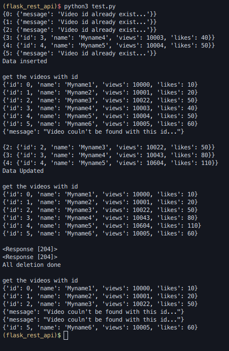

# REST with flask

A small project showing basic functionality of `flask_restful` with three examples

* basics
* video_api_static
* video_api_db

* **basics**:

Basics contain a `hello world` example demonstrating how to get started with flask
and flask_restful

* **video_api_static**

This folder contains data storage in memory(a dictionary) showing functionality of
_get, put, delete_ method

* **video_api_db**

Showing functionality _get, put, patch_ and _delete_ which is full **CRUD(Create, Read, Update and Delete)**
functionality using SQLAlchemy(sqlite) as database

Here's a screenshot of it working:

